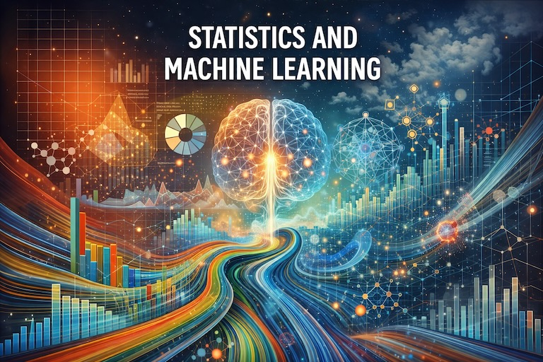

<p align="center">
  
</p>

# Statistics and Machine Learning

A clean academic repository for the **Statistics and Machine Learning** course.

## Repository Goals

- Organize the course material week by week.
- Provide complete and beginner-friendly (master's level) Week 1 learning resources.
- Separate lecture-support materials from practical lab activities.

## Weekly Structure

- `Week_01_Statistical_Foundations_and_Inference/` (fully developed)
  - `Lecture_Support/`: concept reinforcement, worked examples, take-home style exercises.
  - `Practical_Lab/`: guided in-class tasks and detailed solutions.
  - `data/`: notes for datasets used in Week 1.
- `Week_02_Machine_Learning_Foundations_and_Regression/` (placeholder)
- `Week_03_Classification_Evaluation_and_Regularization/` (placeholder)
- `Week_04_Unsupervised_Learning_Time_Series_and_Reporting/` (placeholder)

## Week 1 Learning Outcomes

1. Distinguish variable types and perform dataset inspection.
2. Compute and interpret descriptive statistics.
3. Use visualizations to understand distributions and outliers.
4. Explain sampling behavior and the Central Limit Theorem.
5. Perform and interpret correlation, t-tests, and ANOVA.

## Environment

Install dependencies:

```bash
pip install -r requirements.txt
```

All notebooks are designed to run in both **Jupyter Notebook** and **Google Colab**.
